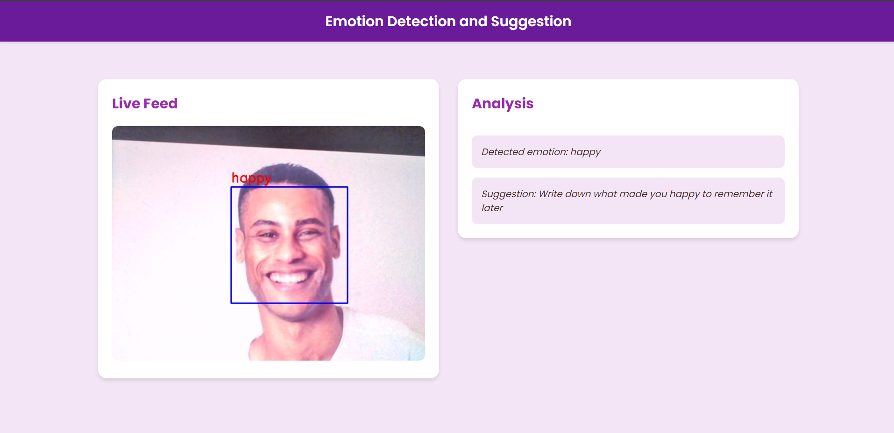

# Emotion Detection and Suggestion App

## Overview

This project is an interactive web application that uses computer vision and machine learning to detect emotions from facial expressions in real-time. Based on the detected emotion, the app provides personalized suggestions to help users manage their emotional state.

## App Layout



*Figure 1: Layout of the Emotion Detection and Suggestion App*

## Features

- Real-time emotion detection from webcam feed
- Emotion classification into 7 categories: angry, disgust, fear, happy, neutral, sad, surprise
- Dynamic suggestions based on detected emotion
- Clean and responsive user interface
- Continuous updates of emotion and suggestion every 2 seconds

## Tech Stack

- Backend: Python, Flask
- Frontend: HTML, CSS, JavaScript
- Machine Learning: Keras, OpenCV
- Video Processing: OpenCV

## Prerequisites

Before you begin, ensure you have met the following requirements:

- Python 3.7+
- pip (Python package manager)
- Webcam

## Installation

1. Clone the repository:
   ```
   git clone https://github.com/yourusername/emotion-detection-app.git
   cd emotion-detection-app
   ```

2. Create a virtual environment (optional but recommended):
   ```
   python -m venv venv
   source venv/bin/activate  # On Windows use `venv\Scripts\activate`
   ```

3. Install the required packages:
   ```
   pip install -r requirements.txt
   ```

4. Download the pre-trained model files (`emotiondetector.json` and `emotiondetector.h5`) and place them in the project root directory.

## Usage

1. Start the Flask server:
   ```
   python app.py
   ```

2. Open a web browser and navigate to `http://localhost:5000`

3. Grant permission for the application to access your webcam when prompted.

4. The app will start detecting your emotions and providing suggestions in real-time.

## Project Structure

```
emotion-detection-app/
│
├── app.py                 # Main Flask application
├── templates/
│   └── index.html         # HTML template for the web interface
├── emotiondetector.json   # JSON file of the pre-trained model architecture
├── emotiondetector.h5     # H5 file containing the model weights
├── requirements.txt       # Python dependencies
└── README.md              # Project documentation
```

## Customization

You can customize the suggestions for each emotion by modifying the `suggestions` dictionary in `app.py`. Feel free to add more emotions or change the existing suggestions to better suit your needs.

## Acknowledgements

- Emotion detection model based on [add source/inspiration here]
- OpenCV for computer vision tasks
- Flask for the web framework

## Disclaimer

This application is for educational purposes only and should not be used as a substitute for professional mental health advice. If you're experiencing severe emotional distress, please seek help from a qualified mental health professional.
